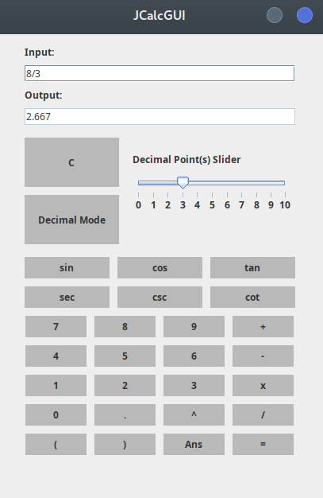
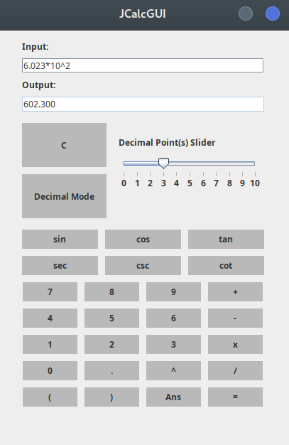
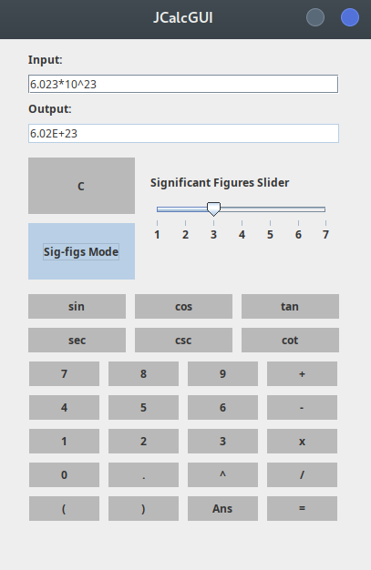

# JavaCalculator
A calculator application written in Java (JDK 18)

### Introduction
The JavaCalculator is a simple calculator application written in Java (using openJDK 18).
It uses the Shunting-yard algorithm to convert infix input to postfix expression, it then evaluates the expression and put the answer to the output line.

### Installation
To install the JavaCalculator, make sure that you have the JDK 18 installed.
Then, run the following command:
```bash
git clone https://github.com/notkaramel/JavaCalculator.git
cd JavaCalculator
./Compile.sh
```


### Calculator in decimal mode: 



### Calculator in sigfig mode:

